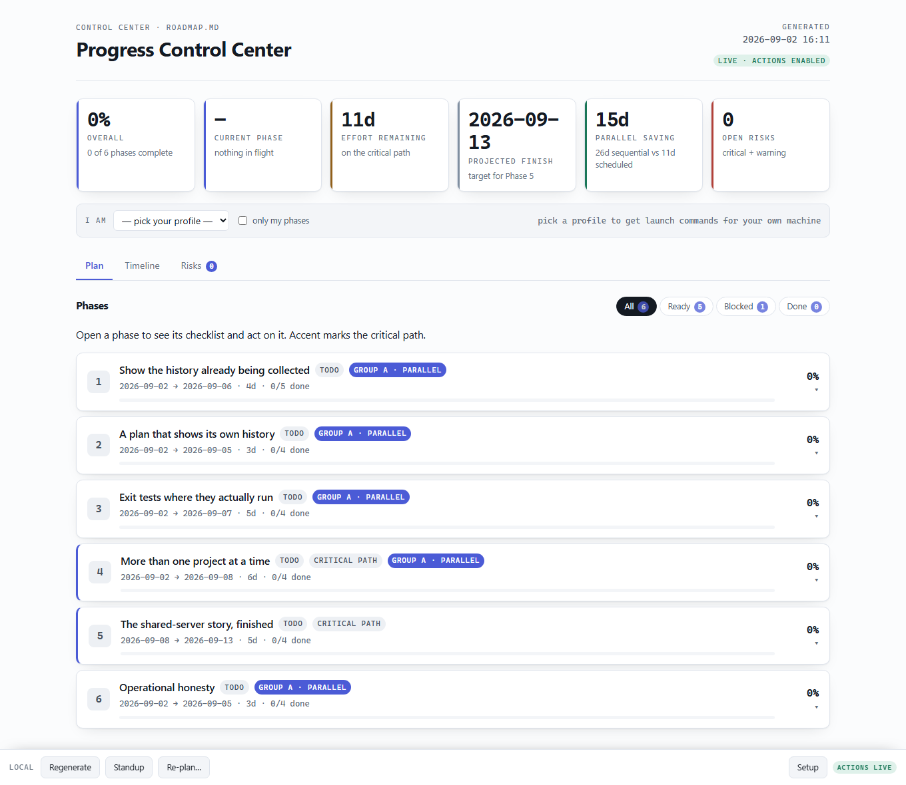
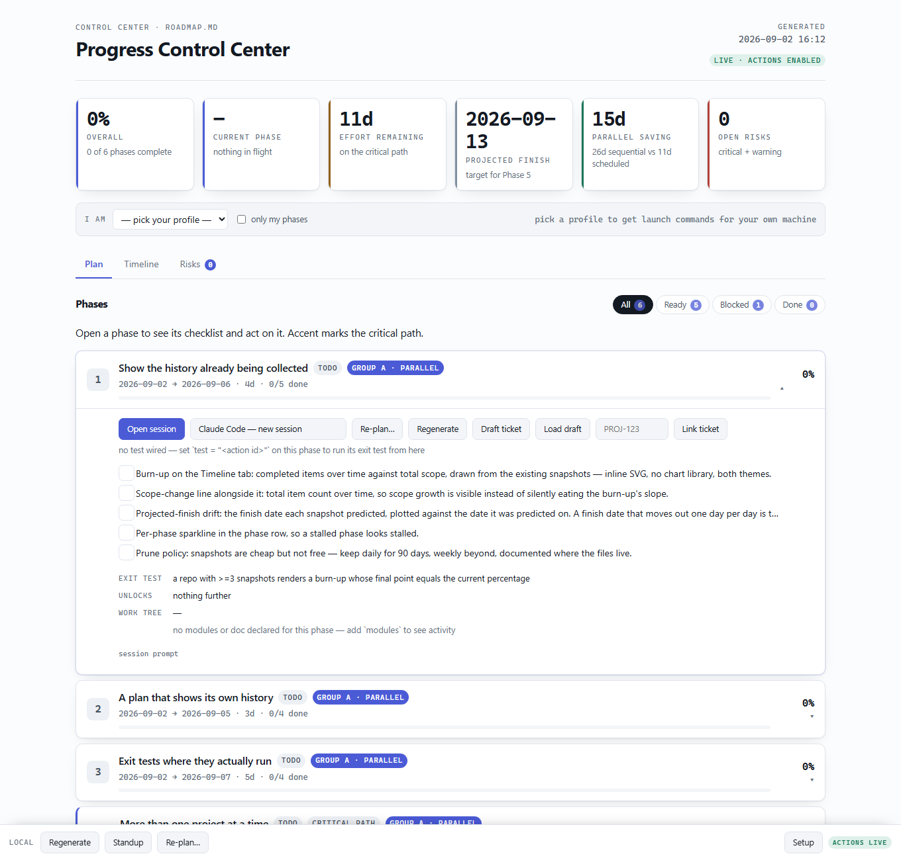
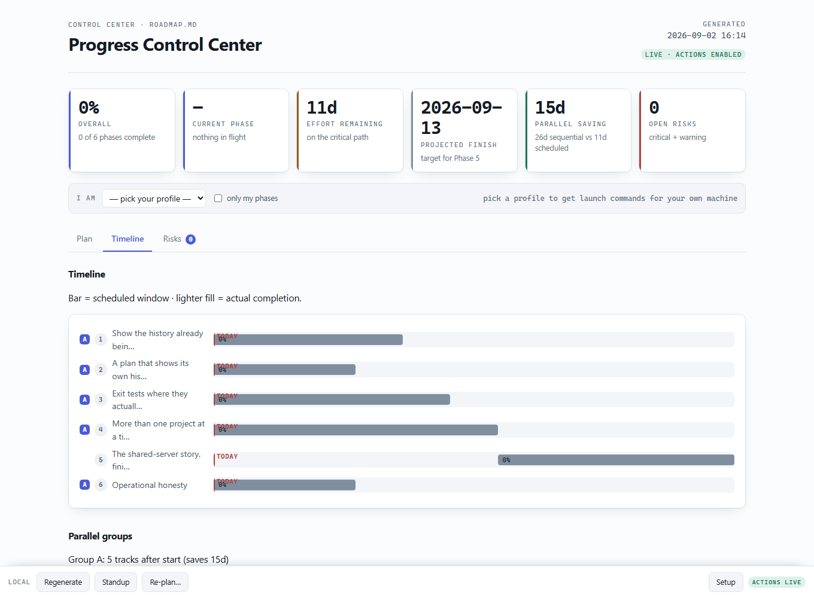
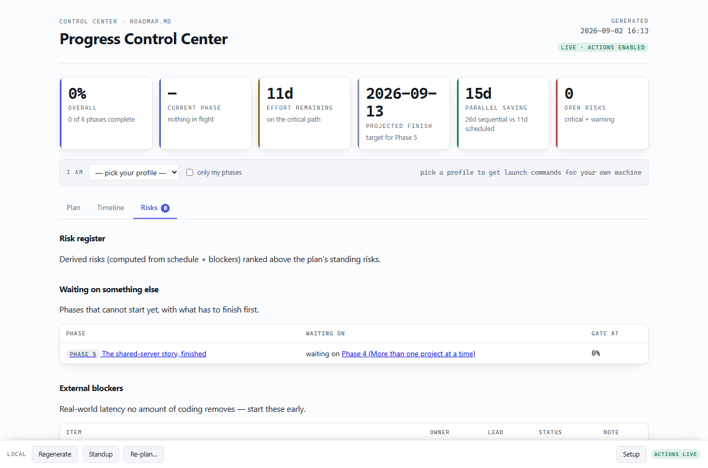
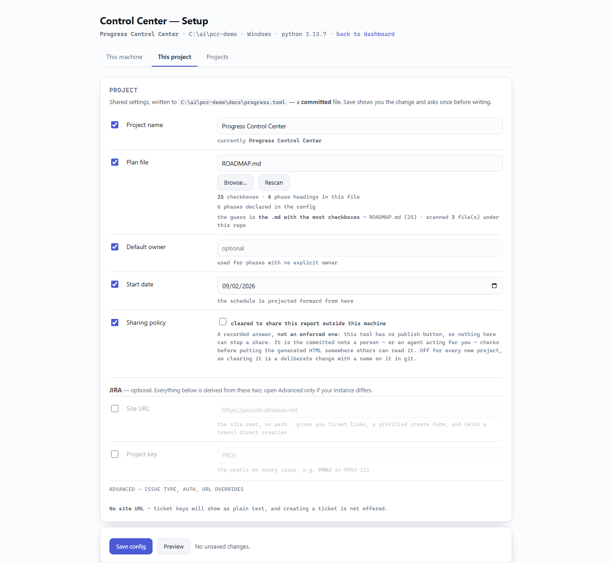

# Progress Control Center

A plan dashboard that **derives** progress from the markdown checkboxes you already
write, and turns each phase into something you can act on — run its tests, open a
coding session scoped to one checklist item, draft its ticket.

Two Python files. No pip install, no framework, no database.

```bash
python progress-serve.py --repo /path/to/your/project
```

An unconfigured project opens the setup wizard; a configured one opens the dashboard.



> **See it in 30 seconds.** This repo is configured with its own
> [ROADMAP.md](ROADMAP.md) as its plan, so cloning it and running
> `python progress-serve.py --repo .` gives you the dashboard above — the tool
> tracking its own roadmap. Every screenshot on this page is that.

---

## What it solves

**Plans go stale, and status gets retyped.** A plan is written once, drifts within a
week, and the truth about progress moves into standups, spreadsheets and someone's
head. Every status update is a human re-reading the repo and typing what they found.

This inverts that. The markdown checkboxes you already write **are** the status —
there is nothing to update — and the plan itself is editable from the dashboard by a
coding session that can re-assess it against the repo as it stands today. The plan
stops being a document you maintain and becomes one that maintains itself.

**And the gap between "I know what to do" and "the agent knows what to do."** Opening
a coding session on a piece of work means re-explaining the phase, its exit test, its
open items, and which knowledge sources to consult. Here that prompt is already
built, from the plan, per phase or per checklist item.

## Where it saves time

| Instead of | You |
|---|---|
| writing a status report | open the page — progress is derived, nothing to update |
| working out what can start now | read *Ready* — dependencies are resolved for you |
| guessing the finish date | read the projected finish and the critical path |
| pasting context into an AI session | click **Open session** — the prompt is built from the phase |
| writing a ticket from scratch | click **Draft ticket**, review, create — key written back |
| rewriting a plan that drifted | click **Re-plan…**, add steering, let a session edit it |
| chasing "is your checkout the same as mine?" | teammates get a launch command for *their* machine |
| a standup document | `--standup` writes it from the snapshot diff |

## What it integrates

| | |
|---|---|
| **Coding agents** | Claude Code, Codex, opencode, Cursor, VS Code — new session or continue, detected on PATH |
| **Issue tracking** | JIRA Cloud and Server/DC — draft, review, create over the API, key recorded on the phase |
| **Knowledge** | any MCP provider (stateless or stateful HTTP) as a `[[context]]`, its usage rules injected into every session prompt |
| **Your repo** | git activity per phase, checkbox write-back, `--check` contract lint |
| **Your services** | TCP reachability probes across one or more hosts, adopted as context providers |
| **Nothing else** | Python ≥ 3.11 stdlib. No pip install, no daemon, no account, no telemetry |

## The one rule

**Progress lives only in your plan's checkboxes.** `- [ ]`, `- [x]`, `- [~]`.

There is no status field, no percentage you maintain, and no second store — not a
database, not a ticket system. Tick a box in the markdown and the dashboard moves.
Tick a box *in* the dashboard and it rewrites that line in the markdown.

Everything else — dependencies, effort estimates, lead times — lives in one
`docs/progress.toml`, because markdown cannot express them.

The consequence worth stating: the plan and the report can never disagree, because
there is only one of them.

## What you get

**A phase list.** Each phase expands in place to its checklist, exit test, what it
unlocks, and the git activity under its modules. Filter to what's *ready* (every
dependency met), what's *blocked*, or what's *done*.

**A schedule you did not write.** From `depends_on` and `days` it computes the
critical path, what can run in parallel, when each phase can start, and a projected
finish. Phases whose real technical dependency differs from their order in the plan
are exactly where the parallelism shows up.

**Actions on the phase, not beside it.** Run that phase's exit test and watch the
output stream in. Open a coding session — new or continuing an existing one — with
a prompt already scoped to the phase, or to one checklist item. Ask a session to
draft a JIRA ticket, review it, and create it.

**A plan that stays current.** *Re-plan…* on any item, phase, or the whole plan hands
the rethink to a coding session with your steering attached and your context
providers consulted — it edits the plan and the config, under rules that keep done
work done and headings machine-readable. Saving the config reconciles `[[phase]]`
blocks with the plan's headings, so adding a phase to the markdown is enough. And the
page reloads itself when the plan changes on disk, so a `git pull` from a teammate
lands on your screen instead of going unnoticed.

**A risk register** derived from the schedule: what is on the critical path, what
external blockers will stall which phase, and how much slack is left.

### A phase, expanded

Every action sits on the phase itself — run its exit test, open a session scoped to
it, re-plan it, draft its ticket. The checklist is the plan's own checkboxes; ticking
one here rewrites that line in the markdown.



### The schedule you did not write

`depends_on` and `days` are all you supply. The critical path, the parallel groups,
each phase's earliest start and the projected finish are computed.



### Risks, derived rather than maintained



### Setup that shows its reasoning

Every autodiscovered value is shown *with the evidence for it* and can be changed or
switched off. Nothing reaches the committed config until you save, and the diff of
what landed is shown afterwards.



## Two surfaces, different powers

The same template renders twice, and they are **not** interchangeable:

| | runs commands | shareable |
|---|---|---|
| `progress-serve.py` on `127.0.0.1` | yes | no |
| the generated `.html` file | no | yes |

A published copy is static: it cannot reach localhost, so it must never show a Run
button that only pretends to work. It says `snapshot · read-only` in its header; the
live one says `live · actions enabled`. Where the live page launches a session, the
static one hands you the exact shell command instead — honest about what it can do.

## Install

```bash
git clone https://github.com/<you>/progress-control-center
python progress-control-center/progress-serve.py --repo /path/to/project
```

Stdlib-only, Python ≥ 3.11 (for `tomllib`). Nothing to install, no supply chain —
which is also why it runs on a locked-down work machine.

Copy the two files rather than adding this repo as a submodule: a submodule pins
this URL into your project's source control, and a subtree imports its history.

## Adopting a project

Point it at a repo and configure in the browser:

```bash
python progress-serve.py --repo /path/to/project
```

With no `docs/progress.toml` it opens on **`/setup`**, whose two tabs are
*This machine* (your name, tool, shell — written to a profile outside every
repo) and *This project* (name, plan file, owner, integrations, tokens, and your
checkout of this project). Not all of that tab is committed: the config fields go
to `docs/progress.toml`, tokens to a gitignored env file beside it, and the
checkout to your profile, keyed by this repo — it is per project, but it is
yours, so it never enters git. Every autodiscovered value shows the evidence behind it and
can be changed or switched off. Nothing reaches the committed config until you
preview the diff.

JIRA asks for two things: the site URL and the project key. The browse URL,
create URL, API base, API version and auth mode are derived from them and shown
as they are derived; Advanced holds the overrides for an instance that differs.
The block ends with whether creating an issue can actually work, and names what
is missing if it cannot — otherwise an absent account email surfaces only as a
401, at the moment you try to raise a ticket.

Or from a terminal, for scripted installs:

```bash
python progress-report.py --init  --repo /path/to/project --name "My Project"
python progress-report.py --setup --repo /path/to/project    # your own profile
python progress-report.py --check --repo /path/to/project    # lint the contract
python progress-report.py        --repo /path/to/project -o report.html
```

`--check` exists for one specific silent failure: a phase whose heading the parser
cannot match resolves zero items and reads **0% forever**, which looks like idleness
rather than misconfiguration.

## The contract

Two things:

1. **A plan in markdown** with `### Phase <id> — <name>` headings (or per-phase
   docs), whose checkboxes are the only store of progress.
2. **`docs/progress.toml`** holding what markdown cannot express.

```toml
[project]
name       = "My Project"
plan       = "PLAN.md"
start_date = "2026-01-06"
allow_artifact_publish = false      # recorded sharing policy — see docs/DESIGN.md

[[phase]]
id         = "1"
name       = "Ingest pipeline"
days       = 3                      # working days of focused effort, not calendar
depends_on = []                     # the REAL technical dependency, not plan order
doc        = "docs/PHASE-1.md"
exit_test  = "curl /health -> 200"
modules    = ["services/ingest"]    # paths; the phase shows git activity under them
test       = "smoke"                # id of an [[action]] — never a command itself
owner      = "alice"
jira       = "PROJ-101"

[[action]]                          # the Run buttons
id = "smoke"; label = "Smoke tests"; kind = "argv"; args = ["npm", "test"]

[[blocker]]                         # real-world latency no code removes
id = "vendor-key"; name = "Vendor API key"; owner = "you"; lead_days = 5
```

Everything except `[project]` and `[[phase]]` is optional and degrades to nothing.
See [`docs/DESIGN.md`](docs/DESIGN.md) for the full schema and the reasoning.

## Security

This runs commands on your machine, so:

- it binds `127.0.0.1` only — never `0.0.0.0`. To reach it from elsewhere, tunnel:
  `ssh -N -L 8765:127.0.0.1:8765 user@host`
- every mutating request carries a per-run token, and the `Host` header must be
  loopback (which is what stops DNS rebinding)
- commands come from an allowlist. There is no passthrough: the browser sends a
  **key**, never an argv
- **`[[action]]` and `[[launcher]]` argvs are hashed and approved once**, at a
  console, with the store kept outside every repo. Cloning a repo does not grant it
  command execution on your machine, and switching projects in the UI never can —
  an unapproved project is served read-only with its commands named but stripped
- credentials are environment-variable **names** in config; values live in
  gitignored files and reach a launched session by file path, never on a command
  line and never through the page
- plan text is repo-authored and is escaped before it reaches an inline `<script>`,
  because that block also carries the API token

## Accessibility

Checked against WCAG 2.1 AA, measured on the rendered page rather than by eye: no
contrast failures, no interactive target under 24px, no `role="button"` on a
non-button, labelled controls, real landmarks, and a native `<details>` for every
disclosure so its keyboard behaviour and announced state come from the platform.

Automated checks catch perhaps a third of real issues. This has not been tested with
a screen reader.

## Where it is going

[ROADMAP.md](ROADMAP.md) — six phases, ordered cheapest-truth-first, with the
non-goals written down. It is also this repo's plan file, so the roadmap and the
dashboard cannot disagree.

## Licence

MIT. See [LICENSE](LICENSE).
